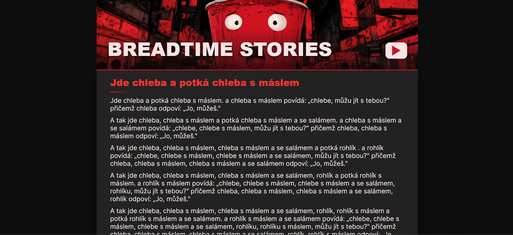

# 🍞 Breadtime Stories - Jde chleba a potká chleba s máslem

 

A web implementation of the classic Czech internet joke where bread meets bread with butter, creating an exponentially growing 45-minute robotic monologue.

🔗 **[Live Demo](https://alena0490.github.io/Chleba-s-maslem/)**

## ✨ Features

- Text-to-speech with Czech voice synthesis
- Play/Stop controls
- Algorithmically generated text with nested loops
- Proper Czech declensions (nominative, accusative, vocative cases)
- Responsive design with creepy aesthetic

## 🛠️ Tech Stack

- React 18
- TypeScript
- Web Speech API (Czech language support)
- Vite

## 🎮 How It Works

The algorithm iterates through types of bread (chleba, rohlík, houska...) and their states (plain, with butter, with butter and salami), creating an exponentially growing dialogue that takes 45 minutes to read.

## 💻 Installation

```bash
git clone https://github.com/Alena0490/Chleba-s-maslem
cd Chleba-s-maslem
npm install
npm run dev
```

## 📬 Contact

- Portfolio: [alena-pumprova-cz]
- LinkedIn: [linkedin.com/in/alena-pumprová]
- Email: [mailto:alenapumprova@seznam.cz](mailto:alenapumprova@seznam.cz)
